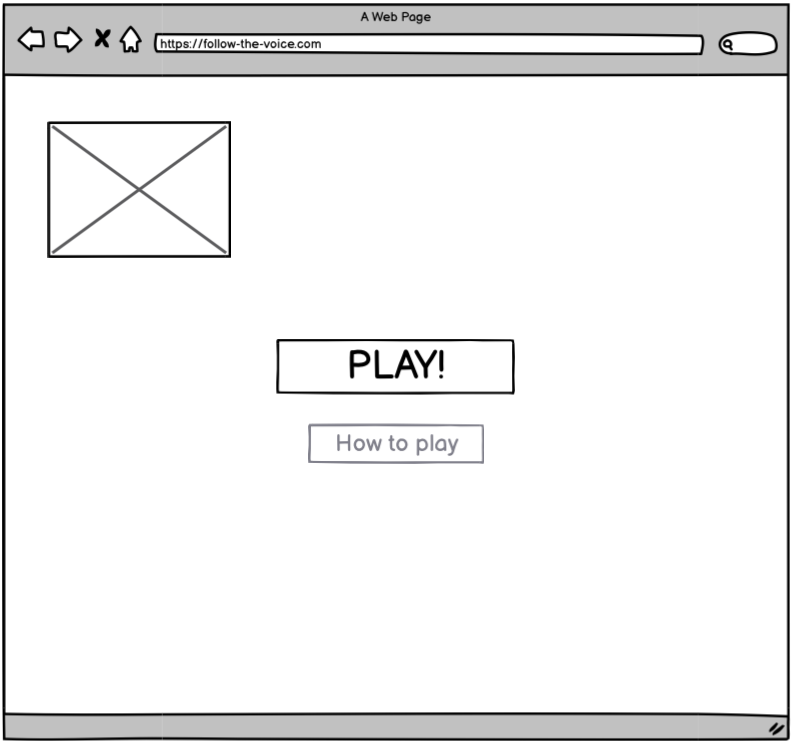
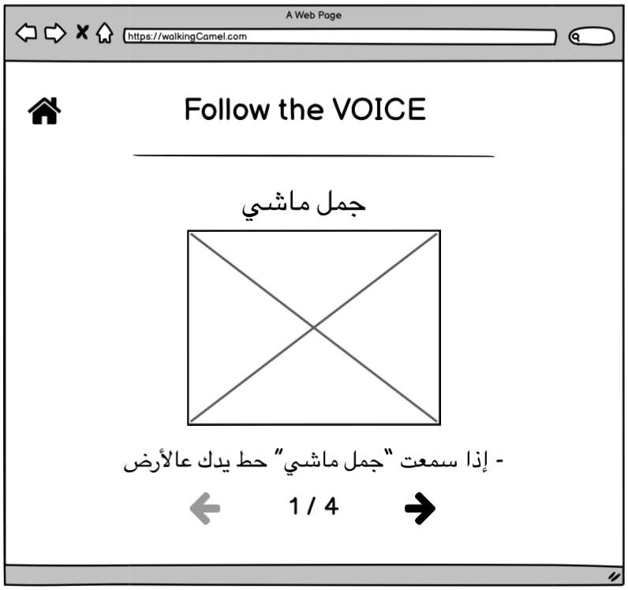
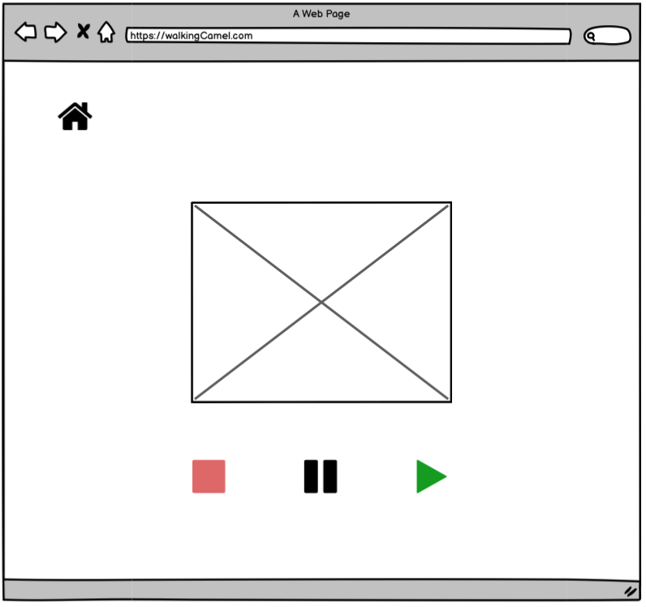
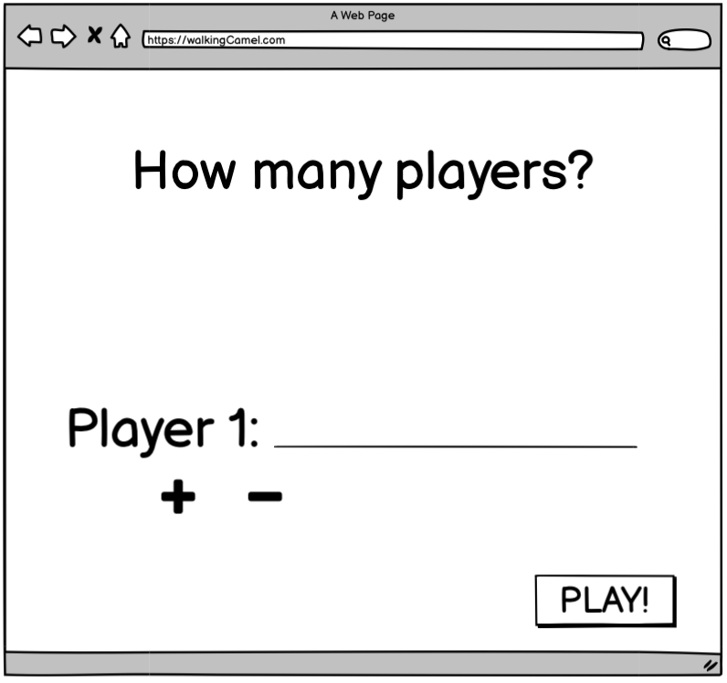

# Follow The Voice

 

### Description

its a game that contains a group of people sitting next to each other and in front of them a person who throws phrases and distracts them with his actions while they follow the phrases and not actions.

 

---

###  Technologies used
- HTML
- CSS
- Javascript
- jquery
- Terminal
- git
- github

 

---

### Wireframes

 

 

 

 

---

### Document

 

---

### unsolved problems
- get the player names and make an alert box to check the loser

 

---

### User stories
- as a user, i want a guidenes of the game so i can know how the game is played
- as a user, i want to add as many players as i want so i can play with a big group of people.
- as a user, i want a user friendly interface so i can navigate between pages easily.
- as a user, i want to pause the game so if one of the members of the group got busy.
- as a user, i want to be able to delete all players and play a free game with no losers.
